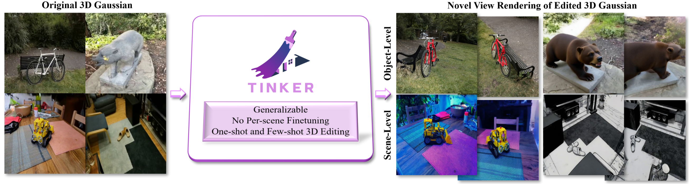

<div align="center">
  
</div>


# TINKER: Diffusion's Gift to 3D--Multi-View Consistent Editing From Sparse Inputs without Per-Scene Optimization

[](https://arxiv.org/abs/2508.14811)
[](https://aim-uofa.github.io/Tinker/)
[](#)
[](https://opensource.org/license/bsd-2-clause)
<!-- [](#) -->

## 📣 News

- [2025-08-21] Paper Released!

## 🚀 Overview

<div align="center" >

</div>

## 📖 Description

Compared with traditional approaches that either rely on per-scene optimization to maintain consistency or require fine-tuning to generate multi-view consistent edited images for every individual scene, **Tinker** is able to generalize without any additional training. Starting from sparse inputs, it produces dense, multi-view consistent edited images for both object-level and scene-level edits, thereby enabling fast 3DGS editing.


## 🚩 Plan
- [ ] Data and Data Pipeline
- [ ] Source code of Scene Completion Model
- [ ] Pipeline of 3DGS editing using NeRFStudio

## 🎫 License

For academic use, this project is licensed under [the 2-clause BSD License](https://opensource.org/license/bsd-2-clause). 
For commercial use, please contact [Chunhua Shen](mailto:chhshen@gmail.com).

## 🖊️ Citation

If you find this work useful, please consider citing:

```bibtex 
@article{zhao2025tinkerdiffusionsgift3dmultiview,
    title={Tinker: Diffusion's Gift to 3D--Multi-View Consistent Editing From Sparse Inputs without Per-Scene Optimization}, 
    author={Canyu Zhao and Xiaoman Li and Tianjian Feng and Zhiyue Zhao and Hao Chen and Chunhua Shen},
    year={2025},
    journal={arXiv preprint arXiv:2508.14811}, 
}
```